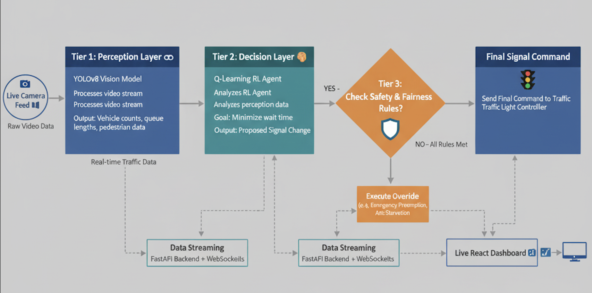

# 🚦 The Route Cause - AI-Powered Traffic Management System  
**Submission for Smart India Hackathon 2025**  


---

## The Problem We Solve  
Static, pre-programmed traffic signals are fundamentally inefficient. They cannot adapt to:

- Sudden traffic surges during peak hours or events.

- The urgent need of an ambulance or fire truck.

- Uneven traffic flow, where one lane is congested while another is empty.

- Pedestrian crossing needs.
---

## Our Intelligent 3-Tier Architecture
We've engineered a multi-layered AI system where each component has a distinct and critical role, mimicking a human-like decision-making process.

### Tier 1: The Perception Layer (The Eyes)  
A state-of-the-art YOLOv8 Computer Vision model acts as our eyes on the street. It processes live video feeds to provide a constant stream of high-fidelity data:

- Detects & Classifies: Accurately identifies cars, buses, trucks, motorcycles, and pedestrians.

- Counts & Tracks: Maintains a real-time count for each lane.

- Calculates Density: Measures queue lengths to understand congestion levels.  

### Tier 2: The Decision Layer (The Brain)  
The raw data is fed to our Q-Learning Reinforcement Learning agent. This is the strategic brain of the operation. It has been trained over thousands of simulations to learn the optimal traffic signal strategy. Its single goal: minimize wait times and maximize traffic throughput. It constantly asks, "What's the most efficient signal phase to activate right now?"  

### Tier 3: The Guardian Layer (The Supervisor)  
AI needs oversight. A powerful Rule-Based Optimization Engine acts as a guardian, supervising the Q-Learning agent's decisions to ensure safety, fairness, and responsiveness to critical events. This layer enforces non-negotiable rules:

- Emergency Vehicle Preemption: Detects emergency vehicles and initiates a high-priority override sequence to clear a path, saving precious seconds.

- Gridlock Prevention: If a queue length exceeds a critical threshold, it triggers an override to service that lane immediately.

- Starvation Prevention: A fairness timer ensures no vehicle waits indefinitely, guaranteeing a minimum level of service for all lanes.
  

  
---

## Key Features & Innovations  

| Innovation | Description & Impact |
| :--- | :--- |
| **Adaptive Signal Control** | Green light duration is allocated based on real-world demand, not a fixed clock. **Impact:** Drastically reduces average wait times and vehicle idling. |
| **Emergency Preemption** | A professional-grade clearing sequence (`yellow` -> `all-red` -> `dedicated green`) provides a clear path for first responders. **Impact:** Saves lives by shortening emergency response times. |
| **Live Digital Twin Dashboard** | A real-time React dashboard visualizes every detected vehicle, AI decision, and signal state. **Impact:** Provides complete transparency and operational oversight for city traffic managers. |
| **Guaranteed Fairness** | Our “starvation” prevention algorithm ensures that low-traffic lanes aren’t ignored, promoting equitable flow. **Impact:** Increases driver satisfaction and prevents isolated congestion. |

---

## Tech Stack  

- **AI & Computer Vision**: Python, OpenCV, PyTorch, YOLOv8, Q-Learning  
- **Backend & Data Pipeline**: Python, FastAPI, WebSockets  
- **Frontend & Visualization**: React.js, TypeScript, Vite, TailwindCSS, Recharts  
- **Deployment**: Vercel (Frontend), Railway (Backend)  

---

## How to Run This Project  

### Prerequisites  
- Python 3.10+  
- Node.js and npm/yarn  
- A video file (`my_video.mp4`) of traffic for the AI to process  

### Backend & AI Agent Setup  
```bash
cd backend
python -m venv venv
source venv/bin/activate (for MacOS) || venv\Scripts\activate (for Windows)
pip install -r requirements.txt
uvicorn main:app --reload
python run_live_agent.py
```

### Frontend Setup  
```bash
cd frontend
npm install
npm run dev
```

---
